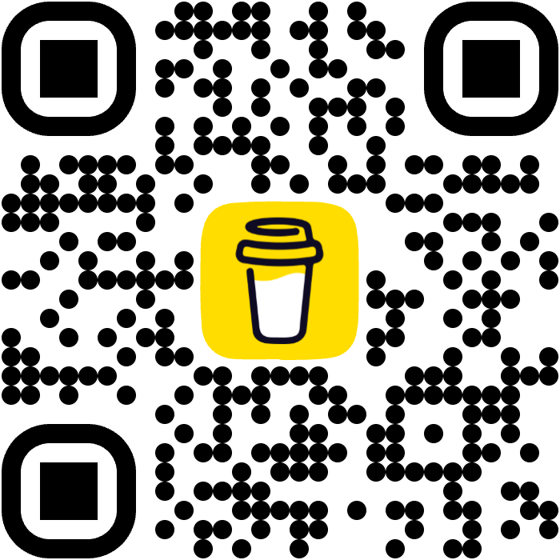

# Leech Balancer

The Leech Balancer plugin for Anki is designed to prevent cards that you are capable of learning from turning into leeches. Even when you consistently answer cards correctly, their lapse count remains unchanged. Sometimes, cards become leeches because of a bad day, a brain fart, or simply because it's been a while since you reviewed them. Especially when you first start to learn a card, there might be many days where you fail it before it starts to click. This doesn't necessarily mean that the card is poor or that the user is unable to learn it.

This plugin reduces the lapse count of a card after you demonstrate consistent success with it. By ensuring that lapses are reduced for cards you consistently answer correctly, this plugin helps you focus on learning rather than penalizing temporary setbacks.

### Why use this plugin?

This plugin is ideal for learners who:

Want to rehabilitate potential leech cards that they can learn with consistent effort.
Understand that occasional mistakes shouldn't permanently mark a card as problematic.

## How It Works

- After every answer, the add-on looks at the card's review history.
- If the card has been answered correctly N times in a row (no "Again" in
  between) the lapse count is reduced by 1.
- Optionally, lapses can be reset straight to 0 instead (see configuration).
- A toast shows when a lapse was reduced or reset (can be disabled).

## Configuration

Open **Tools > Leech Balancer Config**:

- **Required correct answers** (default 3) — consecutive correct answers
  needed before a lapse is reduced.
- **Show toast** (default on) — show a toast notification when a lapse is
  reduced/reset.
- **Reset lapses to zero** (default off) — set the lapse count to 0 instead of
  decrementing it when the threshold is met.

## Credits

Derived from [LeechToolkit](https://github.com/iamjustkoi/LeechToolkit) by
iamjustkoi — thanks for the original add-on.

---

